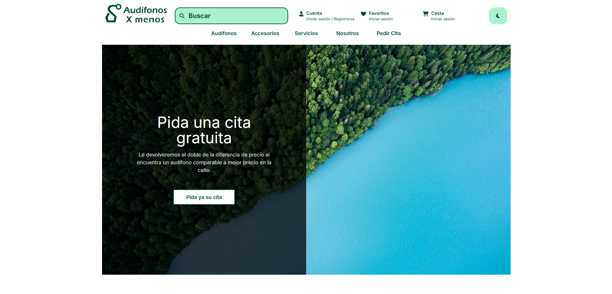

# Audífonos X menos

AudifonosXmenos is an e-commerce of earphones and accessories oriented to elder people. So the main pillars are accesibility, usability and affordable prices.

This web application is in property of [@KandV008](https://github.com/KandV008).

| Current Version |
| :-: |
| `v1.1.0` |

## :clapper: Preview

<strong>From here, all project documentation will be described.</strong>

## :scroll:Table of Contents

1. [Requirement Analysis](#black_nib-requirement-analysis)
    1. [Entities](#black_joker-entities)
    1. [Type of Users](#busts_in_silhouette-type-of-users)
    1. [Functional Requirements](#wrench-functional-requirements)
    1. [Non Functional Requirements](#electric_plug-non-functional-requirements)
1. [Design](#straight_ruler-design)
    1. [Navigation](#airplane-navigation)
    1. [Branding](#performing_arts-branding)
    1. [Architecture](#church-architecture)
1. [DataBase](#dvd-database)
    1. [SQL Database](#dress-sql-database)
    1. [NoSQL Database](#page_facing_up-nosql-database)

### :black_nib: Requirement Analysis

This section contains the analysis of the application requirements, specifically the current status.

#### :black_joker: Entities

Currently, there are 2 entities.

| Entities |
| :-: |
| [Product](#product) |
| [User](#user) |
| [Bargain](#bargain) |
| [Novelty](#novelty) |
| [Order](#order) |

##### Product
The products are the main entity of the application. There are organized by categories. 

Now, there is only 2 categories:

| Product Categories | Attributes|
| :-: | :-- |
| Earphone | Id, Name, Description, Price, Color, Special Earphone Attributes |
| Accessory | Id, Name, Description, Price, Color, Special Accesory Attributes |

Depending of the category, the information display will be diferent.

##### User
See this section to know more about the [Entity User](#busts_in_silhouette-type-of-users).

##### Bargain
Bargains are a code that can be used in the shopping cart to apply a series of discounts. 

You can only use one at the same time.

| Attributes | | | | |
| :-: | :-: | :-: | :-: | :-: |
| Id | Code | Title | Description | Action |

##### Novelty
Novelties are notices of events on the web. They can be discounts, news, notification, etc. 

They are accompanied by a promotional image, and may even contain a series of products that are affected by the novelty.

| Attributes | | | | | |
| :-: | :-: | :-: | :-: | :-: | :-: |
| Id | Code | Title | Promotional Image | Discount | Concerned Products |

##### Order
Order is the result of doing a shopping in the application that contains all the information related to a purchase.

#### :busts_in_silhouette: Type of Users

In the application there are 2 different type of user:

| Type of User | Attributes |
| :-: | :-- |
| Unregistered User | It can interact with all pages but not with the products |
| Registered User | It can interact with anything |
| Admin User | As Registered User plus CRUD operations to entities |

#### :wrench: Functional Requirements

In this section contains all the functional requirement of the software with the different type of user that can done the action.

The functional requirements are classified by context, and you can find a link to each one to learn more:

1. [Configuration actions](/docs/wiki/functional-requirements/configuration.md)
2. [User Basic actions](/docs/wiki/functional-requirements/user-basic.md)
3. [Registered User actions](/docs/wiki/functional-requirements/registered-user.md)
4. [Admin User actions](/docs/wiki/functional-requirements/admin-user.md)

#### :electric_plug: Non Functional Requirements

| Non Functional Requirements |
| :-: |
| Oriented to Web |
| Responsive Design |
| The software must be implemented with React |
| The applicaction need to connect with SQL Database |
| The application need to connect with NoSQL Database |
| GUI must be minimalist and user-friendly |
| Protection & Security for Registered User Data |
| Usability & Accesibility |
| Main language must be Spanish |

### :straight_ruler: Design

In this section describes different aspects of the design of the application with diagrams.

#### :airplane: Navigation

  
   
  <small>Activity Diagram 1. Non Registered User Flow</small>

  
   
  <small>Activity Diagram 2. Registered User Flow</small>

  
   
  <small>Activity Diagram 3. Admin User Flow</small>

  
   
  <small>Activity Diagram 4. Autentication Flow</small>

  
   
  <small>Activity Diagram 5. Special Pages</small>

#### :performing_arts: Branding

This section will show the iconography used to create the application's brand image.

##### Large Logo

|  |  |  |  |
|:---:|:---:|:---:|:---:|
| Figure 1. Black Large Logo | Figure 2. Dark Emerald Large Logo | Figure 3. Light Emerald Large Logo | Figure 4. White Large Logo |

To see the logos in more detail, [click here](/docs/brand/large_logo/).

##### Small Logo

|  |  |  |  |
|:---:|:---:|:---:|:---:|
| Figure 9. Black Small Logo | Figure 10. Dark Emerald Small Logo | Figure 11. Light Emerald Small Logo | Figure 12. White Small Logo |

To see the logos in more detail, [click here](/docs/brand/large_logo/).

##### Web Icon

|  |  |  |  |
|:---:|:---:|:---:|:---:|
| Figure 13. Black Web Icon | Figure 14. Dark Emerald Web Icon | Figure 15. Light Emerald Web Icon | Figure 16. White Web Icon |

To see the logos in more detail, [click here](/docs/brand/web_icon/).

#### :church: Architecture

  
   
  <small>Package Diagram 1. Architecure of Project Bragi</small>

### :hourglass_flowing_sand: RoadMap

This section will discuss the roadmap being followed in the development of the application.

You can view the roadmap for the development of the application up to version `1.0.0` by [clicking here](/docs/wiki/roadmap/dev-roadmap.md).

The roadmap will be updated in the future to mantain and evolve the software.

### :dvd: DataBase

This section will discuss the different databases used to persist the different entities.

#### :dress: SQL Database

The purpose of this database is to manage the next entities:
* User
* Bargain
* Novelty

The application uses [PostgreSQL](https://vercel.com/storage/postgres).

  
   
  <small>Entity Relation Diagram 1. SQL Database</small>

How the product information is stored in the [NoSQL Database](#page_facing_up-nosql-database), in this database only is stored the neccesary information to optimize.

#### :page_facing_up: NoSQL Database

The purpose of this database is to manage all the products available and the orders. The application uses [MongoDB](https://www.mongodb.com).